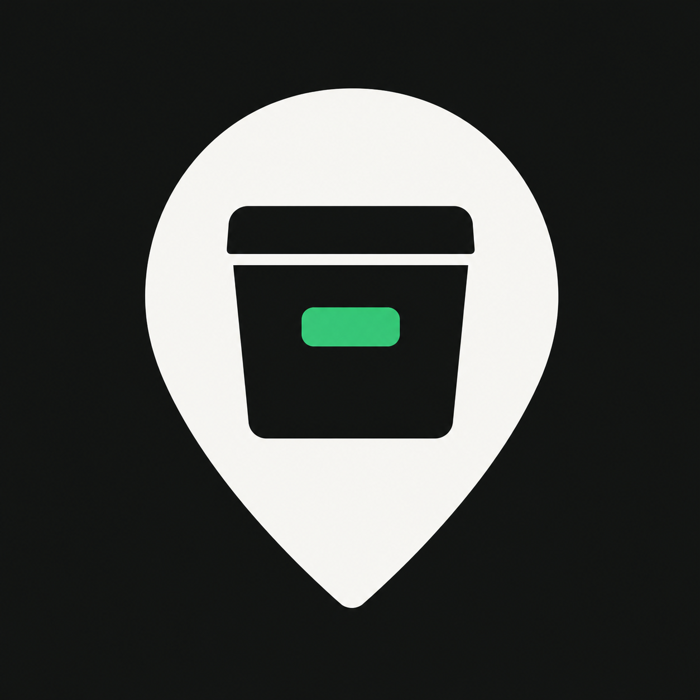
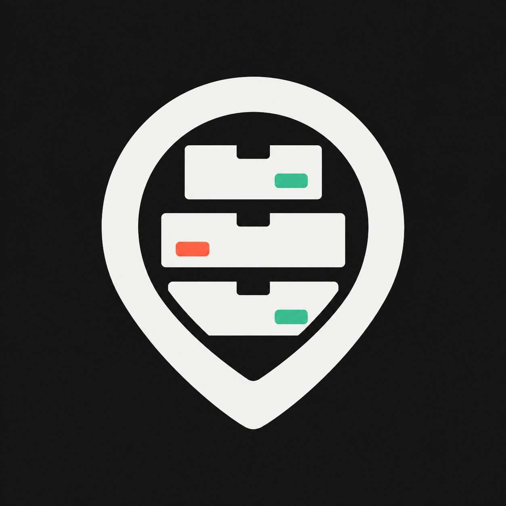

# WITT App Icon Concepts

Prepared July 15, 2026 for product review. These are flattened concept images, not production assets. The shipping `AppIcon` remains unchanged until Sid selects a direction and reviews the final system-rendered variants.

## Recommendation

Refine **Direction B: Storage Stack**. It combines WITT's two most important ideas in one recognizable silhouette: where something is, and the storage hierarchy that contains it. It is more distinctive than the provisional single-bin mark while staying legible and practical.

Direction A is the lower-risk fallback if continuity matters more than distinctiveness. Direction C should not move forward without a substantial redraw.

## Direction A: Refined Pin

- **Idea:** Preserve the current locator-plus-bin metaphor with cleaner proportions and a separated lid.
- **Strength:** Immediate continuity with the TestFlight icon and clear at small sizes.
- **Weakness:** Still reads as a generic box-in-pin mark and does not communicate WITT's nested storage model.
- **Refinement need:** Remove baked shadows and gradients, tighten the lid/body relationship, and give the green label enough weight in tinted and mono appearances.

## Direction B: Storage Stack

- **Idea:** Turn the locator into an enclosure for a compact stack of labeled storage levels.
- **Strength:** Best expression of Place-to-Thing hierarchy, most distinctive silhouette, and still recognizable as storage rather than generic navigation.
- **Weakness:** Three internal levels and three labels may become busy after system highlights at notification size.
- **Refinement need:** Reduce the interior to two or three simpler layers, normalize label placement, preserve generous negative space, and test whether the coral accent is necessary.

## Direction C: Locator Drawer

- **Idea:** Merge a bold locator body with an abstract drawer and a single highlighted Thing.
- **Strength:** Strong contrast and a compact central mass.
- **Weakness:** The current geometry can read as a face or unrelated device, and the storage meaning is not immediate.
- **Refinement need:** A major redraw would be required to remove the face-like reading and clarify the drawer metaphor. This is not recommended while A and B are stronger.

## Production Pass After Approval

1. Redraw the selected concept as simple, clearly edged layers rather than upscaling the generated bitmap.
2. Use a full-bleed opaque background and separate locator, storage, and accent artwork for Icon Composer. Do not bake in blur, mask, shadow, refraction, or specular effects.
3. Keep the same core features across default, dark, clear, and tinted appearances; tune contrast without swapping the symbol.
4. Preview iPhone and iPad Home Screen, Settings, Spotlight, notification, share-sheet, dark, clear, and mono/tinted contexts at real size.
5. Export the flattened 1024 x 1024 marketing image, replace the provisional Xcode asset only after review, and run a clean app build plus simulator screenshot check.

The three concept PNGs are 1254 x 1254 sRGB-style flattened images without alpha. Their resolution is adequate for review but their baked visual effects and lack of editable layers make them unsuitable as final Icon Composer inputs.

## Apple References

Checked July 15, 2026:

- [App icons](https://developer.apple.com/design/human-interface-guidelines/app-icons) - simplicity, unmasked square layers, centered content, clear edges, and appearance consistency.
- [Creating your app icon using Icon Composer](https://developer.apple.com/documentation/Xcode/creating-your-app-icon-using-icon-composer) - 1024 x 1024 layered artwork, layer preparation, and effects to leave for Icon Composer.
- [Icon Composer](https://developer.apple.com/icon-composer/) - current layered Liquid Glass workflow and default, dark, and mono annotation.
